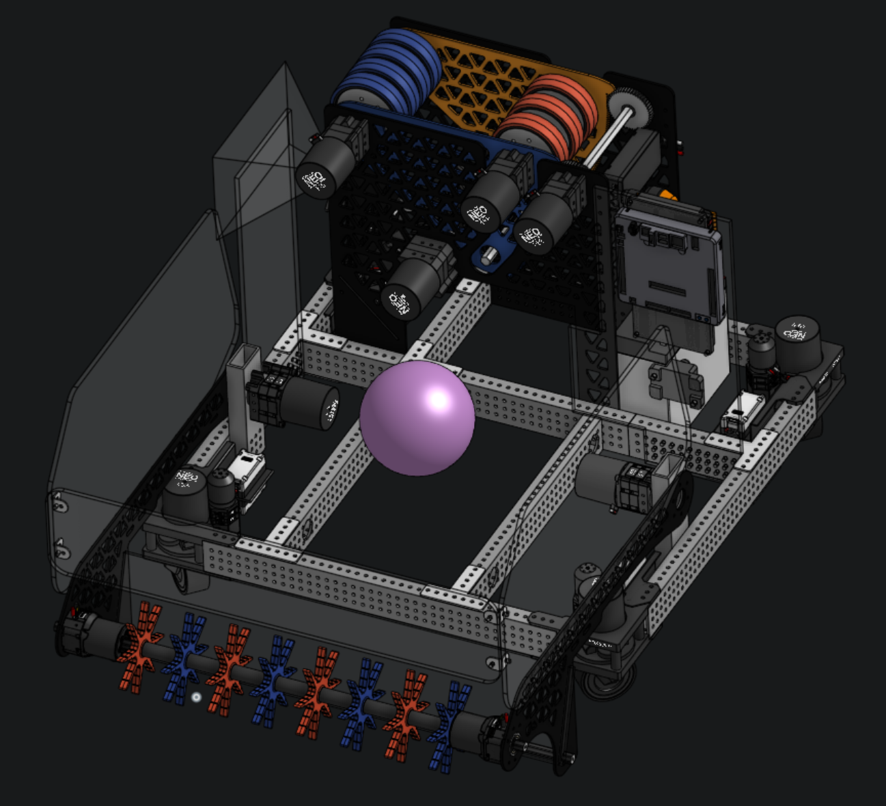

# Barry2026
This is a redesign of the Larry 2026 robot code and design from 7587

## 📂 Project Structure
* 💻 **Code:** Managed here in this repository.
* 🛠️ **CAD Hardware:** Designed through Onshape.
* 📝 **Progress Tracker:** The CADing journey is listed here in the [Build Log](cad/BuildLog.md).

**Current CAD Model Preview:** (Click the image below to open the interactive 3D model)

